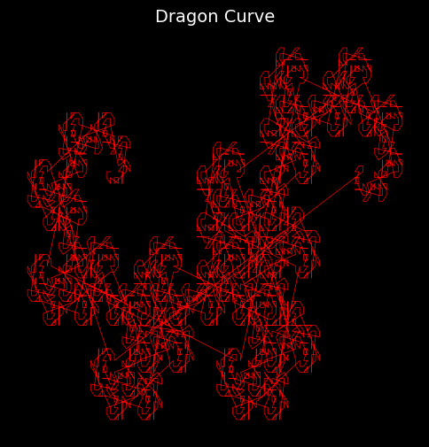
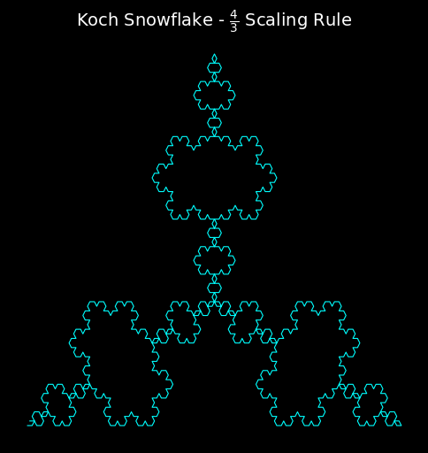

# 🌀 FractalsPy
*A place where we shape fractals into reality using Python*

---

## 📌 About
FractalsPy is a Python-based project that generates stunning fractals using mathematical algorithms. Explore the beauty of **self-similarity** and **infinite complexity** through fractal structures like:

✅ **Barnsley Fern** 🌿  
✅ **Koch Snowflake** ❄️  
✅ **Sierpiński Triangle** 🔺  
✅ **Mandelbrot Set** 🌌  
✅ **Julia Set** 🌀  
✅ **Dragon Curve** 🐉  

For inspiration and additional fractal resources, visit [Fractal Garden](https://www.fractal.garden/).

## 🖼️ Preview
### **Dragon Curve** 🐉

### **Koch Snowflake** ❄️

---

## 🛠 Technologies Used
- **Python** 🐍  
- **Matplotlib** 📊  
- **NumPy** 🔢  

---

## 🎯 Future Enhancements
🔹 **Mandelbrot & Julia Sets**  
🔹 **Interactive GUI for fractal generation**  
🔹 **3D fractals using Matplotlib & OpenGL**  

---

## 👨‍💻 Contributions
Feel free to contribute by submitting issues or pull requests!
